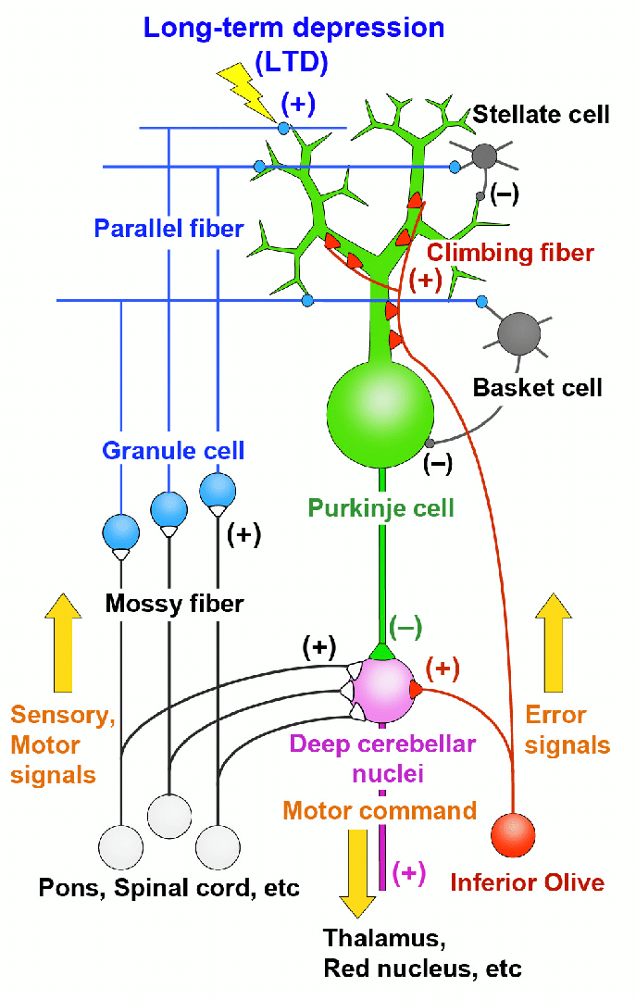
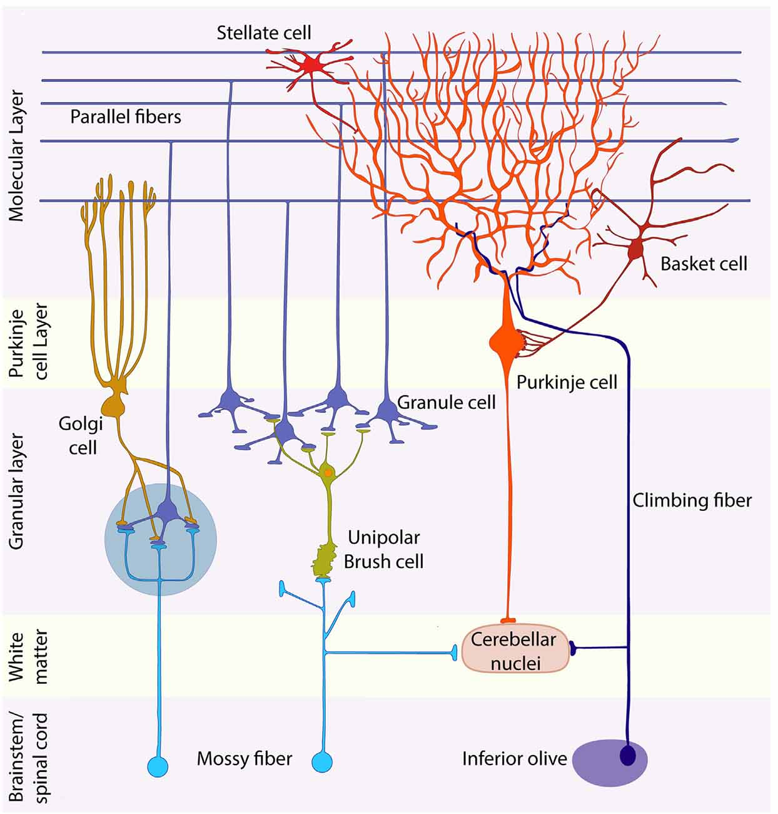
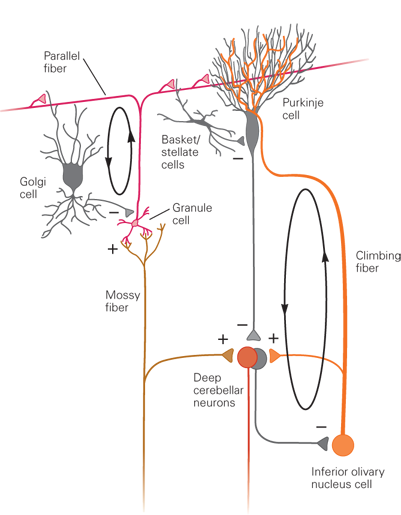

# Notes on the Cerebellum

See [Google Doc](https://docs.google.com/document/d/12uU8koAb03qjG18a2PyhRT3iFcxGvbLhpFZsUj24f6A/edit?usp=sharing)

## How the Cerebellum Works

### Source 1

Source: [https://www.researchgate.net/figure/Simplified-scheme-of-cerebellar-neural-circuitry_fig1_315967443](https://www.researchgate.net/figure/Simplified-scheme-of-cerebellar-neural-circuitry_fig1_315967443)

### Source 2

[https://www.frontiersin.org/journals/neural-circuits/articles/10.3389/fncir.2020.611841/full](https://www.frontiersin.org/journals/neural-circuits/articles/10.3389/fncir.2020.611841/full)

### Source 3

* Kandel and Schwartz, 5e. The Cerebellum, Ch. 42.
    * Maybe this book is worth buying?
* [https://charlesfrye.github.io/FoundationalNeuroscience/16/](https://charlesfrye.github.io/FoundationalNeuroscience/16/)

## Relevant brain structure components

### Inferior Olive
The "inferior olive" refers to a specific brain structure called the "inferior olivary nucleus," which is located in the medulla oblongata, not directly within the cerebellum, and there are two inferior olives, one on each side of the brainstem; it's not a type of cell, but rather a collection of neurons forming a distinct nucleus crucial for motor coordination and learning by sending signals to the cerebellum via climbing fibers. 
