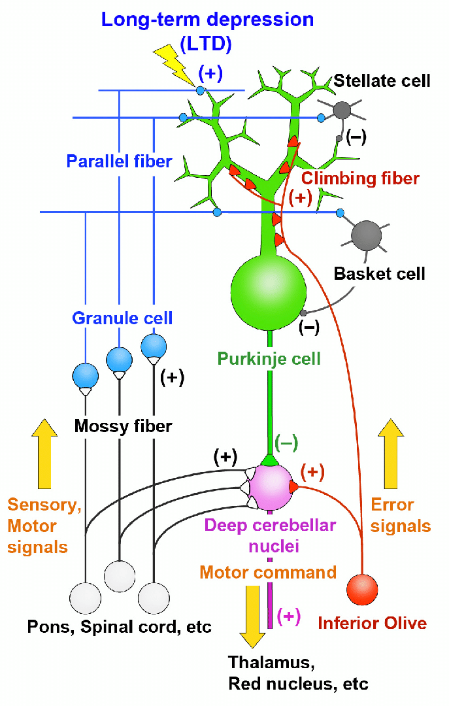
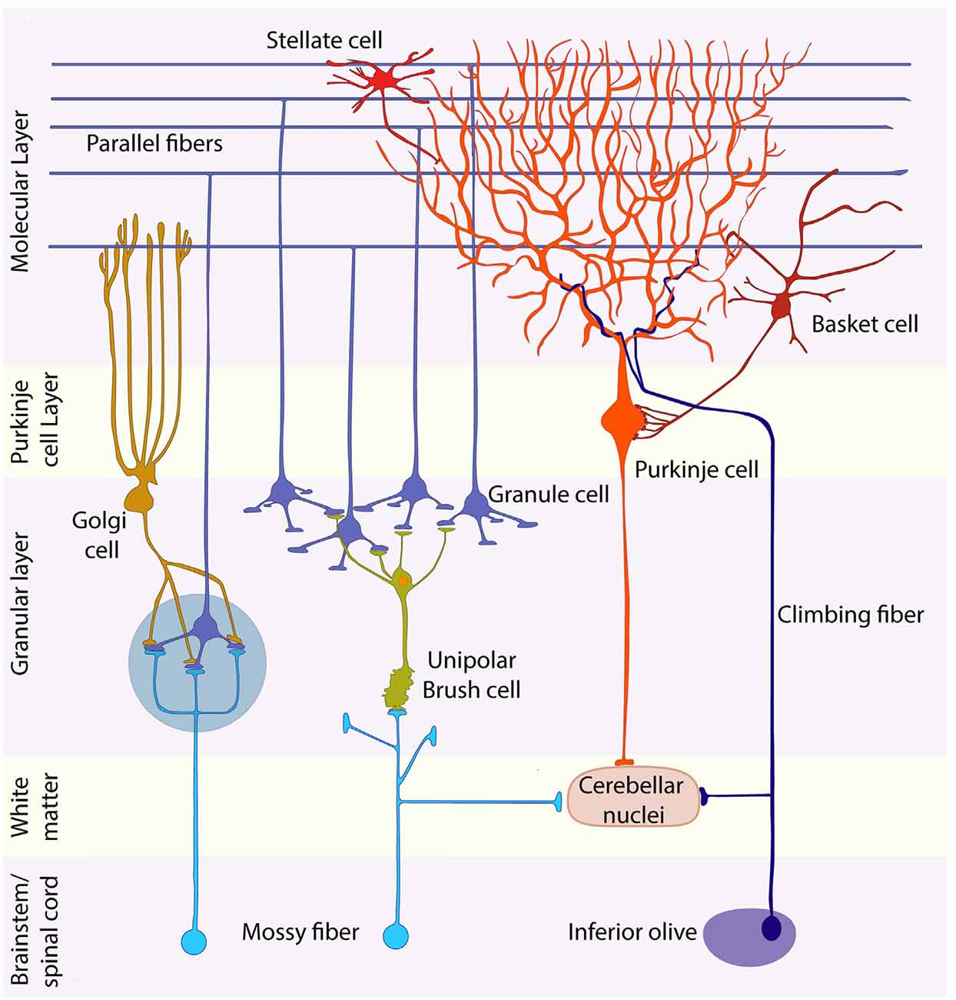
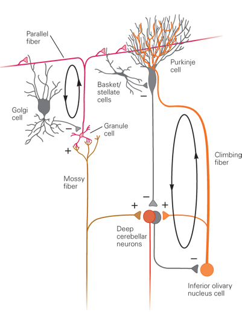

# Notes on the Cerebellum

See [Google Doc](https://docs.google.com/document/d/12uU8koAb03qjG18a2PyhRT3iFcxGvbLhpFZsUj24f6A/edit?usp=sharing)

## How the Cerebellum Works


### Source 1


Source: [https://www.researchgate.net/figure/Simplified-scheme-of-cerebellar-neural-circuitry_fig1_315967443](https://www.researchgate.net/figure/Simplified-scheme-of-cerebellar-neural-circuitry_fig1_315967443)


### Source 2

[https://www.frontiersin.org/journals/neural-circuits/articles/10.3389/fncir.2020.611841/full](https://www.frontiersin.org/journals/neural-circuits/articles/10.3389/fncir.2020.611841/full)


### Source 3

* Kandel and Schwartz, 5e. The Cerebellum, Ch. 42.
    * Maybe this book is worth buying?
* [https://charlesfrye.github.io/FoundationalNeuroscience/16/](https://charlesfrye.github.io/FoundationalNeuroscience/16/)


## Relevant brain structure components

### Inferior Olive
The "inferior olive" refers to a specific brain structure called the "inferior olivary nucleus," which is located in the medulla oblongata, not directly within the cerebellum, and there are two inferior olives, one on each side of the brainstem; it's not a type of cell, but rather a collection of neurons forming a distinct nucleus crucial for motor coordination and learning by sending signals to the cerebellum via climbing fibers. 


## Notes on the code
* To build documentation, I've been experimenting with jsdoc, using the `jsdoc.json` config file. To build documentation:
  ```
  npx jsdoc ./src/neurons/neuron.js -c jsdoc.json
  ```


# Places to Download swc files
* [https://neuromorpho.org/KeywordBrowseView.jsp?count=1555&keywords=%22purkinje%22&browseBy=brainRegion](https://neuromorpho.org/KeywordBrowseView.jsp?count=1555&keywords=%22purkinje%22&browseBy=brainRegion)
* Great video of how synapses work: [https://www.youtube.com/watch?v=hmtQPrH-gC4](https://www.youtube.com/watch?v=hmtQPrH-gC4)
* Vis tips on using Blender to visualize flows: [https://www.youtube.com/watch?v=yaa13eehgzo](https://www.youtube.com/watch?v=yaa13eehgzo)


## How the Architecture Works
For a cerebellar-style spiking model, here's how to structure the initial synapse setup in a way that reflects biology and supports learning:

### 1. Network Architecture
A simplified cerebellar network has these parts:
| Layer          | Role                                   | How many?    |
| -------------- | -------------------------------------- | ------------ |
| Input neurons  | Motor command / sensory input          | 10–100       |
| Granule cells  | Expand inputs into sparse combinations | 1,000–10,000 |
| Purkinje cells | Main output neurons (inhibitory)       | 10–100       |
| DCN neuron(s)  | Deep cerebellar nucleus (final output) | 1            |


### 2. Synapse Types and Initial Connectivity
You should define synapses between layers like this:

#### A. Input → Granule Cells
Randomly connect each input neuron to 10–50 granule cells.

This makes a sparse random projection, which helps diversify signals.

Synapses can be fixed (no learning) or very weakly plastic.


#### B. Granule Cells → Purkinje Cells (Plastic Synapses!)
Fully connect or randomly connect granule cells to Purkinje cells.

These are the plastic synapses — the ones that change during learning.

Start with small random weights, centered around 0.5 or 0.

#### C. Climbing Fiber → Purkinje Cells (Error signal)
Each Purkinje cell gets one climbing fiber input.

Climbing fiber fires only when there's a motor error.

This acts as the "teaching signal".

You don’t need a weight for this — it just triggers plasticity at the right time.

#### D. Purkinje Cells → DCN Neuron(s)
Purkinje cells inhibit the DCN (which outputs to motor).

You can make this a fixed inhibitory connection (weight = -1).

#### E. DCN Neuron → Motor
DCN activity becomes the motor command — this is your output.

### 3. Initial Weights for Plastic Synapses
For Granule → Purkinje (plastic) synapses:

Use small random weights. If all weights are the same, learning takes longer.

If weights are too big/small, the system saturates or does nothing.

### 4. Learning Rule Hooks
Only Granule → Purkinje synapses update, and only if:

* The granule cell recently fired.
* The Purkinje cell fired.
* An error signal (climbing fiber) occurred within a short window.

That’s what triggers STDP-like plasticity:

### Summary
| From → To           | Type       | Plastic? | Initial Weights        | Notes                                 |
| ------------------- | ---------- | -------- | ---------------------- | ------------------------------------- |
| Input → Granule     | Random     | No       | Fixed = 1.0            | Spread input into combinations        |
| Granule → Purkinje  | Random     | Yes      | Random (e.g., 0.3–0.7) | Learning happens here                 |
| Climbing → Purkinje | One-to-one | —        | —                      | Triggers plasticity when error occurs |
| Purkinje → DCN      | Full       | No       | Fixed = -1.0           | Inhibitory output                     |
